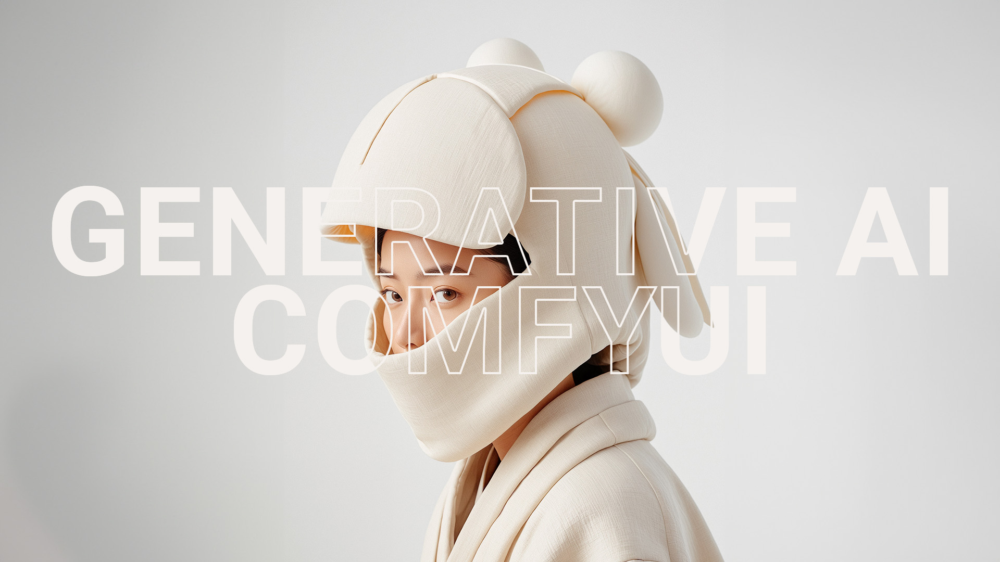
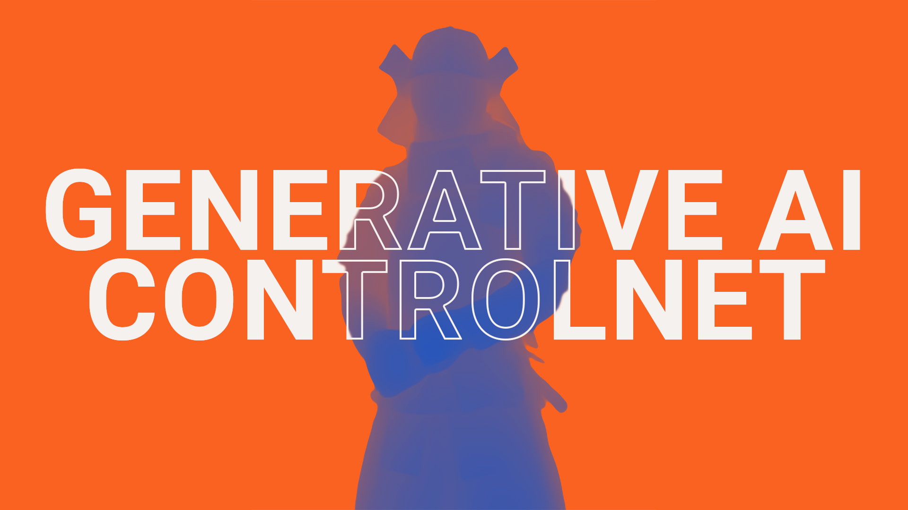

# ComfyUI Guide
In this series of YouTube videos and presentations, you learn how to get started with Generative AI in general and ComfyUI in particular.

## Part One: Getting Started with Stability Matrix and ComfyUI

### Important Links
Slides for this stream – [https://miroleon.github.io/comfyui-guide/](https://miroleon.github.io/comfyui-guide/)
Detailed Tutorial on Heibara Ai Blog – [https://blog.heibara.ai/posts/stability-matrix/](https://blog.heibara.ai/posts/stability-matrix/)
Stability Matrix – [https://lykos.ai/downloads](https://lykos.ai/downloads)
ZavyChromaXL V6 Model – [https://civitai.com/models/119229/zavychromaxl]
AI Prompt Generator – [https://ollama.com/impactframes/llama3_ifai_sd_prompt_mkr_q4km](https://ollama.com/impactframes/llama3_ifai_sd_prompt_mkr_q4km)
Images from Museo (Public Domain) – [https://museo.app/](https://museo.app/)

## Part Two: Getting Started with ControlNet

Planned to go live 5 November 2025 at 13:30h CET

### Important Links:
Slides for this stream – [https://miroleon.github.io/comfyui-guide/controlnet/](https://miroleon.github.io/comfyui-guide/controlnet/)
Detailed Tutorial on Heibara Ai Blog – [https://blog.heibara.ai/posts/stability-matrix/](https://blog.heibara.ai/posts/stability-matrix/)
Stability Matrix – [https://lykos.ai/downloads](https://lykos.ai/downloads)
ZavyChromaXL V6 Model – [https://civitai.com/models/119229/zavychromaxl]
DreamShaper 8 Model – [https://civitai.com/models/4384/dreamshaper](https://civitai.com/models/4384/dreamshaper)
Images from Museo (Public Domain) – [https://museo.app/](https://museo.app/)
Images from Unsplash – [https://unsplash.com/](https://unsplash.com/)
Videos from Pexels – [https://www.pexels.com/](https://www.pexels.com/)